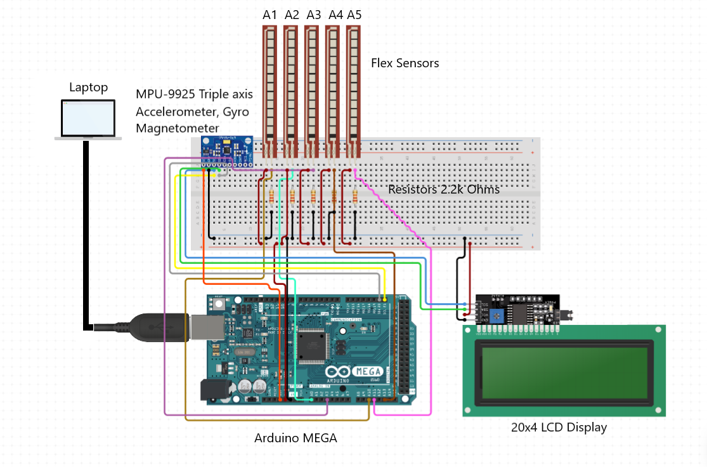

# Gauntlet
Hello, Welcome to my project, **Gauntlet**.  

It is a Sign - to - text/Speech converter that I developed when I participated in **InGenius**, flagship hackathon of PES Insitute of Technology, which was conducted in Oct2018.
To bridge the communication gap between normal and speech impaired, we have developed a low-cost gesture glove for interpretation of sign language.

### Components
- Arduino Mega
- 5x Flex Sensors
- MPU-9925 Accelerometer and Gyro
- BreadBoard
- Resistors 2.2k Ohms x5
- 20x4 LCD Display
- Laptop with MATLAB ( With Neural Network toolbox )

The entire setup of our system consists of a glove to convert the hand gestures to speech. The glove consists of various flex sensors to measure the bend of fingers and palm.
These sensors, which act as variable resistors, were added to each finger and held back using rivets and dashes to ensure a sufficient stability. Between their ends, a potential 
difference was created that we could scan through the analog inputs of Arduino and sent to the Laptop.  

We were using the "Neural Pattern Recognition" toolbox to learn the resistance values of respective symbols and create a model to predict the symbols. After the prediction, the 
Symbol/letter would be played our on a speaker and also be displayed on the LCD screen, to add redundancy.  

 
 
A hardware schematic of the project is shown below:

 
 
A final prototype developed during the hackathon is shown below. (Disclamer: This photo does not contain the LCD screen as it was added later)

 
 
A screenshot of the toolbox used is shown below. It is very easy to use, even people new to Machine Learning (like me) can use it very easily.

Note: The tool produces a C code, which can be easily incorporated into the product. I have not added it in the files above because I lost it. But the interface is fairly simple,
so you won't have a problem developing your own.

Disclaimer : This is very simple prototype of a Sign-to-Text converter, you'll find much complex and good yielding ones online. Scavenge a little more. :smile:

Thank you for your interest in my project. For any more information, feel free to contact me or check out my personal [website](http://mkparihar.github.io).  

**Namaste.** :pray:

